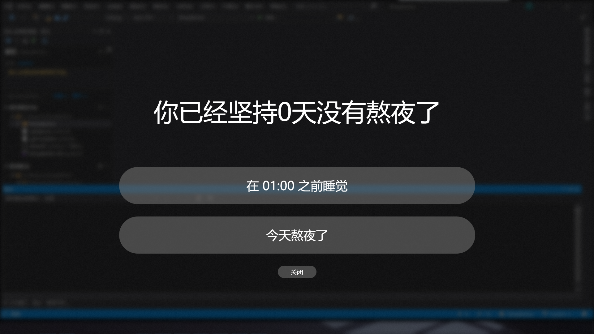

# Sleep Better
一个用来戒除熬夜的打卡程序。



## 部署到我的机器上
为了方便在多台设备之间共享，你需要一个Gitee账号，这个程序将会在Gitee上存储用户数据。    

1. 注册一个Gitee账号。
2. 创建一个公开的Gitee仓库，此仓库只能有一个“master”分支。
3. 在此仓库内创建一个文件“SleepBetter.ini”，内容如下：   
```ini
Days = 0
```    
4. 在Gitee的右上角，你的头像处打开“设置”-“安全设置”-“私人令牌”-“生成新令牌”，至少具有“user_info”和“projects”权限。
5. 打开本项目，打开SleepBetter/Properties/Resources，将令牌、仓库所有者ID、仓库名称写入。
6. 对本项目进行git submodule update --init，确保组件GiteeFS存在。
7. 修改Plan.cs，制定你的熬夜戒除计划。
8. 编译，然后把编译成果放到你的台式电脑、笔记本电脑和平板电脑上。
9. 祝你熬夜戒除成功。
